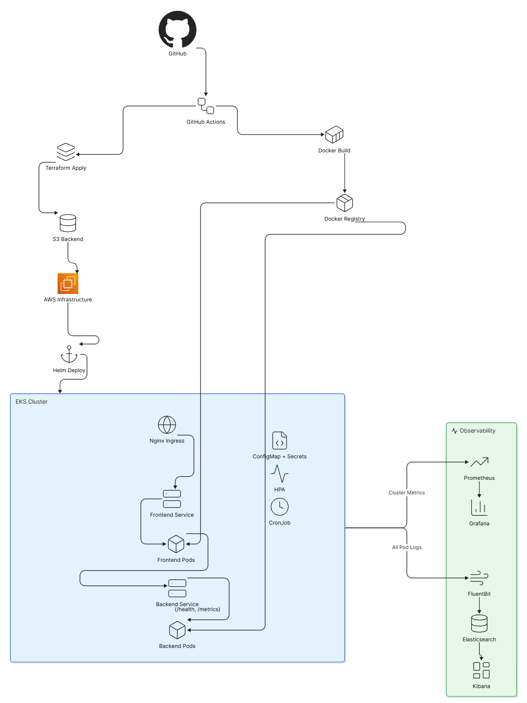
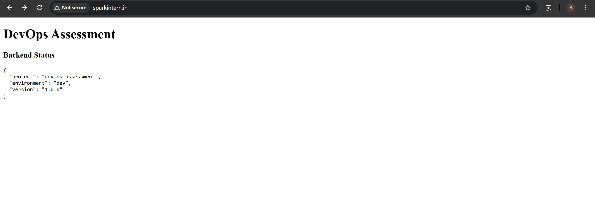
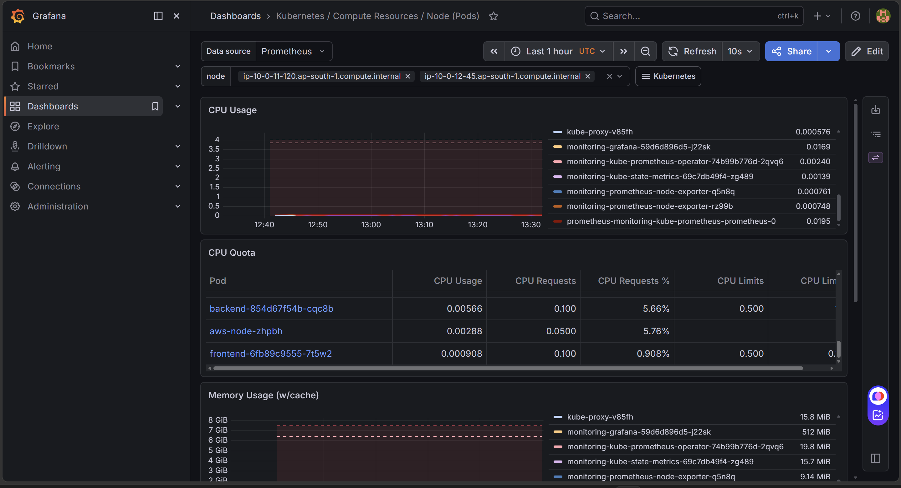
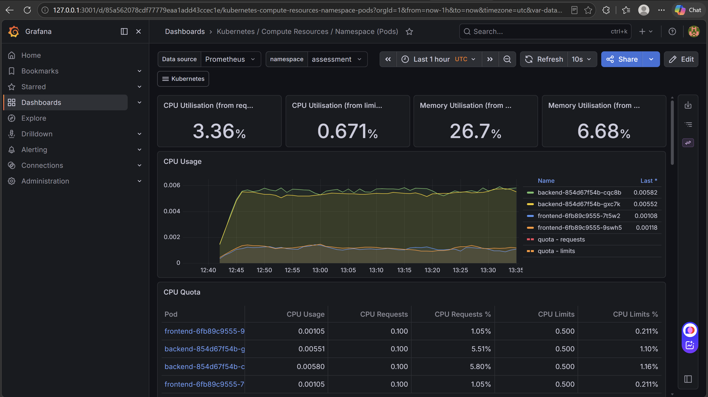
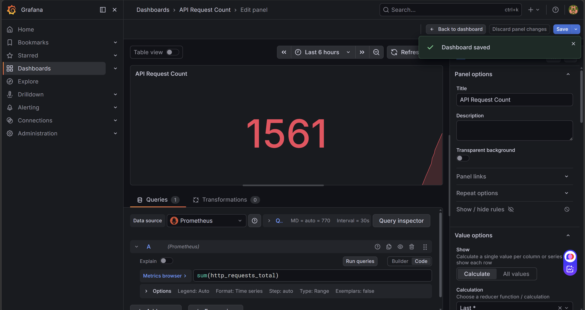
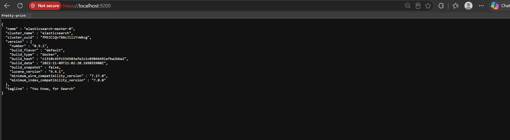
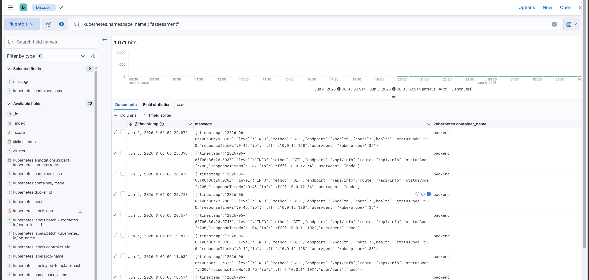
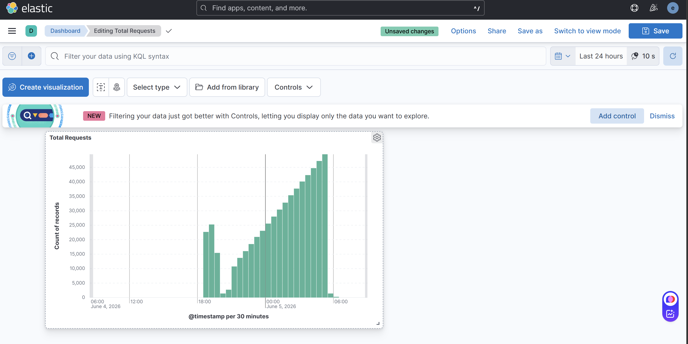

# DevOps Assessment Project

## Project Overview

This project demonstrates a complete end-to-end DevOps implementation on AWS using:

* Terraform
* Amazon EKS
* Docker
* Helm
* GitHub Actions
* Prometheus
* Grafana
* Fluent Bit
* Elasticsearch
* Kibana
* NGINX Ingress Controller

The objective was to provision cloud infrastructure, deploy containerized applications, implement observability, and automate deployments using CI/CD pipelines.

---

# Architecture Diagram



---

# Project Components

## Infrastructure

Provisioned using Terraform:

* VPC
* Public Subnets
* Private Subnets
* Internet Gateway
* NAT Gateway
* Route Tables
* Security Groups
* IAM Roles
* EKS Cluster
* EKS Managed Node Groups
* S3 Backend for Terraform State

---

## Application

### Frontend

Node.js application that:

* Calls backend APIs
* Displays backend status
* Verifies application connectivity

### Backend

Node.js Express application exposing:

```text
/
/health
/api/info
/metrics
```

The `/metrics` endpoint exposes Prometheus metrics.

---

## Kubernetes Components

Deployed using Helm:

* Frontend Deployment
* Backend Deployment
* Frontend Service
* Backend Service
* ConfigMaps
* Secrets
* Horizontal Pod Autoscaler
* CronJob
* Ingress

---

# Project Execution Flow

## Step 1: Clone Repository

```bash
git clone https://github.com/Bablu7011/devops-assessment-bablu.git

cd devops-assessment-bablu
```

---

## Step 2: Configure AWS Credentials

```bash
aws configure
```

Verify:

```bash
aws sts get-caller-identity
```

---

## Step 3: Initialize Terraform

```bash
cd terraform/infrastructure
terraform init \
-backend-config=environments/dev/backend.hcl
```

Validate:

```bash
terraform validate
```

Plan:

```bash
terraform plan
```

Apply:

```bash
terraform apply -auto-approve
```

---

## Step 4: Configure kubectl

```bash
aws eks update-kubeconfig \
--region ap-south-1 \
--name devops-assessment-dev
```

Verify:

```bash
kubectl get nodes
```

Expected:

```text
STATUS: Ready
```

---

## Step 5: Install NGINX Ingress Controller

```bash
helm repo add ingress-nginx \
https://kubernetes.github.io/ingress-nginx

helm repo update

helm upgrade --install ingress-nginx \
ingress-nginx/ingress-nginx \
-n ingress-nginx \
--create-namespace
```

Verify:

```bash
kubectl get pods -n ingress-nginx
```

---

## Step 6: Deploy Monitoring Stack

```bash
kubectl create namespace monitoring
```

Install kube-prometheus-stack:

```bash
helm upgrade --install monitoring \
prometheus-community/kube-prometheus-stack \
-n monitoring
```

Verify:

```bash
kubectl get pods -n monitoring
```

---

## Step 7: Deploy Logging Stack

Create namespace:

```bash
kubectl create namespace logging
```

Install Elasticsearch:

```bash
helm upgrade --install elasticsearch elastic/elasticsearch \
-n logging
```

Install Kibana:

```bash
helm upgrade --install kibana elastic/kibana \
-n logging
```

Install Fluent Bit:

```bash
helm upgrade --install fluent-bit fluent/fluent-bit \
-n logging
```

Verify:

```bash
kubectl get pods -n logging
```

---

## Step 8: Build Docker Images

Backend:

```bash
docker build -t backend .
```

Frontend:

```bash
docker build -t frontend .
```

---

## Step 9: Push Images to ECR

Authenticate:

```bash
aws ecr get-login-password \
| docker login \
--username AWS \
--password-stdin \
<ACCOUNT_ID>.dkr.ecr.ap-south-1.amazonaws.com
```

Push images:

```bash
docker push backend
docker push frontend
```

---

## Step 10: Deploy Application

```bash
helm upgrade --install assessment-app \
helm/assessment-app \
-n assessment \
--create-namespace
```

Verify:

```bash
kubectl get pods -n assessment

kubectl get svc -n assessment

kubectl get ingress -n assessment
```

---

# ECR Design Decision

## Why ECR Is Managed Separately

The ECR repository is intentionally managed outside Terraform.

### Reason

If ECR is created and managed by Terraform:

```bash
terraform destroy
```

would delete:

```text
ECR Repository
+
All Container Images
```

This results in:

* Image loss
* Deployment failures
* Longer recovery times

### Current Approach

Terraform manages:

```text
VPC
EKS
IAM
Networking
Security Groups
```

ECR remains independent and persists application images.

### Benefits

* Image persistence
* Faster infrastructure rebuilds
* Safer disaster recovery
* Immutable image version history

---

# Application Verification

## Website Verification

Application accessible through:

```text
http://sparkintern.in
```

Screenshot:



---

# Observability

The project implements complete observability using:

## Metrics Stack

```text
Prometheus
+
Grafana
```

## Logging Stack

```text
Fluent Bit
+
Elasticsearch
+
Kibana
```

---

# Prometheus Monitoring

Prometheus scrapes metrics from:

* Kubernetes Nodes
* Kubernetes Pods
* Backend Application
* Services

Backend metrics endpoint:

```text
/metrics
```

---

# Grafana Dashboards

## Kubernetes Nodes Dashboard

Tracks:

* CPU Usage
* Memory Usage
* Node Health

Screenshot:



---

## Kubernetes Pods Dashboard

Tracks:

* CPU Usage
* Memory Usage
* Pod Resource Utilization
* Resource Requests & Limits

Screenshot:



---

## API Request Count Dashboard

Query:

```promql
sum(http_requests_total)
```

Screenshot:



---

## API Latency Dashboard

Query:

```promql
rate(http_request_duration_seconds_sum[5m])
/
rate(http_request_duration_seconds_count[5m])
```

Screenshot:


---

# Logging Stack

## Fluent Bit

Runs as a DaemonSet.

Responsibilities:

* Collect container logs
* Enrich logs with Kubernetes metadata
* Forward logs to Elasticsearch

---

## Elasticsearch

Stores centralized logs.

Verification:



---

## Kibana

Provides log exploration and visualization.

Capabilities:

* Search logs
* Filter logs
* View application activity
* Analyze pod logs

Screenshot:



---

## Kibana Dashboard - Total Requests

Custom dashboard created using Elasticsearch data.

Tracks:

* Total requests over time
* Request volume trends

Screenshot:



---

# CI/CD Pipeline

Implemented using GitHub Actions.

---

## CI Pipeline

Triggered on:

```text
Pull Request → Main
```

Performs:

* Terraform Validation
* Docker Build Validation
* Helm Linting
* Manifest Generation
* Artifact Upload

---

## CD Pipeline

Triggered on:

```text
Push → Main
```

Performs:

* Terraform Plan
* Terraform Apply
* Docker Build
* Docker Push
* Helm Deployment
* Rollout Verification

---

## Image Versioning

Uses Git SHA based image tags:

```text
backend-${GITHUB_SHA}
frontend-${GITHUB_SHA}
```

Benefits:

* Immutable deployments
* Rollback support
* Deployment traceability

---

# Challenges Faced & Fixes

## 1. Terraform Backend Configuration

### Issue

Terraform continuously requested backend values.

### Fix

Created:

```text
environments/dev/backend.hcl
```

Initialized using:

```bash
terraform init \
-backend-config=environments/dev/backend.hcl
```

---


## 2. ServiceMonitor Discovery Issue

### Issue

Backend metrics not visible in Prometheus.

### Root Cause

ServiceMonitor missing required label.

### Fix

Added:

```yaml
metadata:
  labels:
    release: monitoring
```

Result:

```text
Backend metrics discovered successfully.
```

---

## 3. Fluent Bit → Elasticsearch Connection Failure

### Issue

Logs were not reaching Elasticsearch.

### Root Cause

Incorrect authentication and TLS settings.

### Fix

Configured:

```ini
HTTP_User elastic
HTTP_Passwd <password>

tls On
tls.verify Off
```

Result:

```text
Logs successfully indexed.
```

---

## 4. Kibana Showing No Logs

### Issue

Kibana displayed:

```text
No results match your search criteria
```

### Root Cause

Incorrect time range.

### Fix

Changed:

```text
Last 15 Minutes
```

to

```text
Last 24 Hours
```

Logs became visible.

---

## 5. Kibana Dashboard Creation

### Issue

Fields such as:

```text
endpoint
statusCode
```

were unavailable for aggregation.

### Root Cause

Application logs were stored as JSON inside the `message` field and were not parsed into separate Elasticsearch fields.

### Current Status

Logs are searchable and visible in Kibana.

Advanced dashboards requiring:

* Endpoint Distribution
* Status Code Distribution
* Error Rate Analytics

require additional log parsing and indexing.

---


---

# Improvements Roadmap

## Security
* Network Policies
* Pod Security Standards

## CI/CD

* Trivy Security Scanning
* SonarQube Integration
* Automated Rollback

## Monitoring

* AlertManager
* Slack Alerts
* PagerDuty Integration

## Logging

* Persistent Elasticsearch Storage
* Log Retention Policies
* Structured Log Parsing

## Kubernetes

* Cluster Autoscaler
* ArgoCD GitOps
* Blue/Green Deployment

---

# Cleanup

Destroy infrastructure:

```bash
terraform destroy
```

Verify:

```bash
aws eks list-clusters
```

Note:

The ECR repository is intentionally preserved and is not removed during infrastructure destruction to avoid loss of application images.
