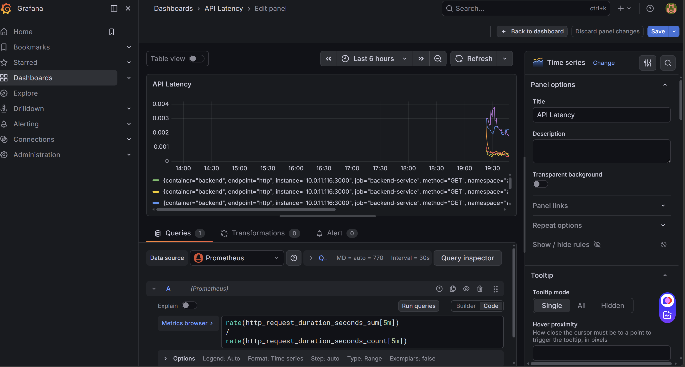
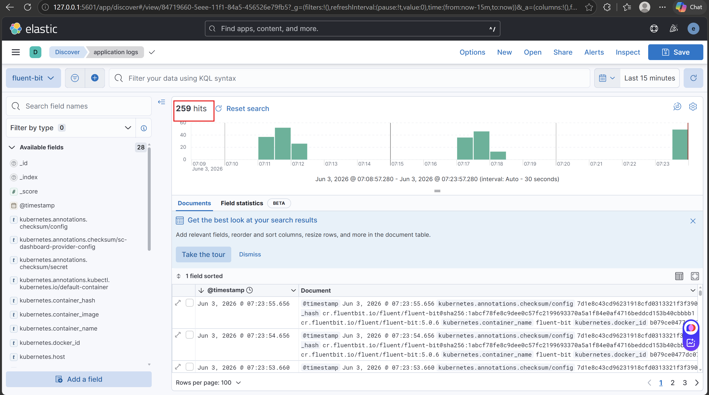

# DevOps Assessment Project

## Project Overview

This project demonstrates a complete end-to-end DevOps implementation on AWS using Terraform, Kubernetes (EKS), Helm, GitHub Actions, Prometheus, Grafana, Fluent Bit, Elasticsearch, and Kibana.

The goal was to build a production-style deployment pipeline that provisions infrastructure, deploys applications, implements observability, and automates deployments through CI/CD.

The project includes:

- Infrastructure provisioning using Terraform
- Containerized frontend and backend applications
- Kubernetes deployment using Helm Charts
- AWS Load Balancer Controller with ALB Ingress
- Horizontal Pod Autoscaling (HPA)
- ConfigMaps and Secrets management
- CronJob deployment
- Metrics collection using Prometheus
- Dashboard visualization using Grafana
- Centralized logging using Fluent Bit + Elasticsearch + Kibana
- CI/CD pipeline using GitHub Actions

---

# Architecture Diagram


---

# 1. Infrastructure (Terraform)

## Infrastructure Components

The infrastructure is provisioned entirely using Terraform.

### AWS Resources Created

- VPC
- Public Subnets
- Private Subnets
- Route Tables
- Internet Gateway
- NAT Gateway
- Security Groups
- EKS Cluster
- EKS Managed Node Groups
- ECR Repository
- IAM Roles
- Load Balancer Controller IAM Permissions
- S3 Backend for Terraform State

---

## Terraform Backend

Terraform state is stored remotely in S3.

### Backend Configuration

```hcl
bucket         = "terraform-state-bucket"
key            = "dev/terraform.tfstate"
region         = "ap-south-1"
dynamodb_table = "terraform-locks"
encrypt        = true
```

### Benefits

- Remote state management
- Team collaboration
- State locking using DynamoDB
- Prevents state corruption

---

## Terraform Deployment Steps

### Initialize Terraform

```bash
terraform init \
-backend-config=environments/dev/backend.hcl
```

### Validate Configuration

```bash
terraform validate
```

### Review Infrastructure

```bash
terraform plan
```

### Create Infrastructure

```bash
terraform apply
```

## Verify Cluster
### EKS Cluster Configuration

After Terraform successfully creates the EKS cluster, configure kubectl to communicate with the cluster.

### Update Kubeconfig

```bash
aws eks update-kubeconfig \
--region ap-south-1 \
--name devops-assessment-dev
```

### Verify Cluster Access

```bash
kubectl get nodes
```

Expected Output:

```bash
NAME                                         STATUS   ROLES    AGE   VERSION
ip-10-0-11-120.ap-south-1.compute.internal   Ready    <none>   xxm   v1.33.x
ip-10-0-12-45.ap-south-1.compute.internal    Ready    <none>   xxm   v1.33.x
```

### Verify System Pods

```bash
kubectl get pods -A
```

Expected Output:

```bash
NAMESPACE     NAME                       STATUS
kube-system   aws-node                   Running
kube-system   coredns                    Running
kube-system   kube-proxy                 Running
```


---

# 2. Application Deployment (Docker + Kubernetes)

## Application Structure

### Backend

Node.js Express API

Endpoints:

```text
/
/health
/metrics
```

Prometheus metrics are exposed through:

```text
/metrics
```

---

### Frontend

Simple Node.js frontend that:

- Calls backend API
- Displays backend information
- Verifies application connectivity

---

## Docker

Both applications are containerized.

### Build Backend

```bash
docker build -t backend .
```

### Build Frontend

```bash
docker build -t frontend .
```

---

## Amazon ECR

Images are pushed to:

```text
Amazon Elastic Container Registry (ECR)
```

Repository:

```text
devops-assessment-app
```

---

## Helm Deployment

Application deployment is managed through Helm.

### Components Deployed

- Frontend Deployment
- Backend Deployment
- Frontend Service
- Backend Service
- ConfigMap
- Secret
- Ingress
- HPA
- CronJob

---

### Deploy Application

```bash
helm upgrade --install assessment-app \
./helm/assessment-app \
-n assessment \
--create-namespace
```

---

## AWS Load Balancer Controller

Ingress is managed using:

```text
AWS Load Balancer Controller
```

Creates:

```text
Application Load Balancer (ALB)
```

Ingress hostname:

```text
sparkintern.in
```

---

## Application Verification

### Website


---

# 3. Observability (Grafana + Kibana)

The project implements complete observability using:

## Metrics Stack

```text
Prometheus
+
Grafana
```

## Logging Stack

```text
Fluent Bit
+
Elasticsearch
+
Kibana
```

---

# Prometheus Monitoring

Prometheus scrapes metrics from:

- Kubernetes Cluster
- Nodes
- Pods
- Backend Application

Metrics endpoint:

```text
/metrics
```

---

# Grafana Dashboards

## Kubernetes Resource Monitoring

Tracks:

- CPU Usage
- Memory Usage
- Resource Requests
- Resource Limits
- Pod Health

### Dashboard


### Pods


### Nodes


---

## Custom Dashboard

### API Request Count

Tracks total API requests received by backend.

Query:

```promql
sum(http_requests_total)
```

Screenshot:


---

### API Latency Dashboard

Tracks average response time.

Query:

```promql
rate(http_request_duration_seconds_sum[5m])
/
rate(http_request_duration_seconds_count[5m])
```

Screenshot:



---

# Logging Stack

## Fluent Bit

Fluent Bit runs as DaemonSet.

Responsibilities:

- Collect pod logs
- Enrich logs with Kubernetes metadata
- Forward logs to Elasticsearch

---

## Elasticsearch

Stores centralized logs.

Verification:


---

## Kibana

Provides log visualization and search.

Capabilities:

- Search logs
- Filter logs
- Investigate application issues
- View pod-level logging

Screenshot:



---

# 4. CI/CD (GitHub Actions)

GitHub Actions automates validation, deployment, and release management.

---

## CI Pipeline (Pull Request)

Triggered when:

```text
Pull Request → Main
```

### Steps

#### Terraform Validation

```bash
terraform validate
```

Validates Terraform syntax.

---

#### Docker Build Test

```bash
docker build
```

Verifies container images can be built.

---

#### Helm Lint

```bash
helm lint
```

Validates Helm templates.

---

#### Artifact Upload

Rendered manifests are uploaded as artifacts.

---

## CD Pipeline (Push to Main)

Triggered when:

```text
Push → Main
```

---

### Terraform Plan

```bash
terraform plan
```

---

### Terraform Apply

```bash
terraform apply
```

---

### Docker Build & Push

Images are built and pushed to ECR.

Image Tags:

```text
backend-${GITHUB_SHA}
frontend-${GITHUB_SHA}
```

Example:

```text
backend-a1b2c3d
frontend-a1b2c3d
```

Benefits:

- Immutable image versions
- Rollback support
- Traceability

---

### Helm Deployment

Images are injected dynamically:

```bash
helm upgrade \
--set backend.image.tag=backend-${IMAGE_TAG} \
--set frontend.image.tag=frontend-${IMAGE_TAG}
```

No manual update of values.yaml required.

---

### Rollout Verification

```bash
kubectl rollout status deployment/backend
kubectl rollout status deployment/frontend
```

---

### Smoke Testing

```bash
curl http://sparkintern.in/health
```

Ensures deployment is healthy.

---

# Challenges Faced & Fixes

## 1. Terraform Backend Configuration

### Issue

Terraform continuously asked for backend values during initialization.

### Fix

Created:

```text
environments/dev/backend.hcl
```

and initialized using:

```bash
terraform init \
-backend-config=environments/dev/backend.hcl
```

---

## 2. VPC Module Naming Mismatch

### Issue

Module names referenced in Terraform did not match actual module definitions.

### Fix

Ensured module names in:

```text
main.tf
```

and

```text
modules/vpc
```

matched exactly.

---

## 3. Clouddrove VPC Module Compatibility Issue

### Issue

Terraform failed with:

```text
Unsupported attribute "region"
```

Error:

```text
data.aws_region.current.region
```

### Root Cause

New AWS provider versions expose:

```text
data.aws_region.current.name
```

instead of:

```text
data.aws_region.current.region
```

### Fix

Updated:

```hcl
data.aws_region.current.region
```

to:

```hcl
data.aws_region.current.name
```

inside module code.

---

## 4. Image Versioning Strategy

### Issue

Using:

```yaml
tag: latest
```

causes deployment traceability problems.

### Fix

Implemented Git SHA based image tags:

```text
backend-${GITHUB_SHA}
frontend-${GITHUB_SHA}
```

and injected via:

```bash
helm --set
```

during deployment.

---

## 5. AWS Load Balancer Controller Service Account Issue

### Issue

eksctl showed:

```text
aws-load-balancer-controller
```

but Kubernetes Service Account was missing.

### Fix

Deleted and recreated the IAM Service Account correctly.

---

## 6. ALB Controller IAM Permission Issue

### Issue

Ingress was stuck and ALB was not created.

### Root Cause

IAM policy was outdated.

Missing permission:

```text
elasticloadbalancing:DescribeListenerAttributes
```

### Fix

Updated IAM policy to latest AWS Load Balancer Controller version and restarted controller.

Result:

```text
ALB created successfully
```

---

## 7. Prometheus ServiceMonitor Discovery Issue

### Issue

Backend metrics were not visible in Prometheus Targets.

### Root Cause

Prometheus expected:

```yaml
release: monitoring
```

label.

ServiceMonitor did not contain it.

### Fix

Added:

```yaml
metadata:
  labels:
    release: monitoring
```

Result:

```text
Backend metrics discovered successfully.
```

---

## 8. Elasticsearch Storage Design Decision

### Issue

Persistent storage increases infrastructure complexity and cost.

### Decision

For assessment purposes Elasticsearch was deployed without persistent storage.

### Production Recommendation

Use:

```text
AWS EBS CSI Driver
```

with Persistent Volumes for Elasticsearch data persistence.

---

# Improvements Roadmap

The current implementation satisfies the assessment requirements. Future improvements include:

---

## Security Improvements

- AWS Secrets Manager Integration
- External Secrets Operator
- IAM Roles for Service Accounts (IRSA) for all workloads
- Pod Security Standards
- Network Policies

---

## CI/CD Improvements


- Trivy Security Scanning
- SonarQube Code Analysis
- Multi-Environment Deployment
- Automated Rollback Strategy

---

## Monitoring Improvements

- AlertManager Integration
- Slack Notifications
- PagerDuty Integration


---

## Logging Improvements

- Persistent Elasticsearch Storage
- Log Retention Policies

---

## Kubernetes Improvements

- Cluster Autoscaler
- ArgoCD GitOps Deployment
- Blue/Green Deployment


---


# Current Known Limitations & Ongoing Work

Although all major assessment requirements have been successfully implemented and validated, a few improvements are currently in progress.

---

## 1. GitHub Actions CD Pipeline Issue

### Current Status

The CI pipeline is working successfully and performs:

* Terraform Validation
* Docker Build Validation
* Helm Linting
* Artifact Upload

However, the CD pipeline is currently being finalized.

### Issue

The Clouddrove VPC module version used in this project contains references such as:

```hcl
data.aws_region.current.region
```

which are incompatible with the newer AWS provider versions used during GitHub Actions execution.

### Local Fix

Locally, the issue was resolved by updating:

```hcl
data.aws_region.current.region
```

to:

```hcl
data.aws_region.current.name
```

inside:

```text
.terraform/modules/vpc/main.tf
```

### Challenge

The fix works locally because Terraform downloads the module into the local `.terraform` directory.

During GitHub Actions execution, the module is downloaded again from the registry, causing the same issue to reappear.

### Current Work

The module is being migrated to a custom/forked version so that the fix becomes permanent and the CD pipeline can execute Terraform Plan and Apply successfully inside GitHub Actions.

---

## 2. Kibana Application Analytics Dashboard

### Current Status

The logging pipeline is operational:

```text
Application Pods
        ↓
Fluent Bit
        ↓
Elasticsearch
        ↓
Kibana
```

Logs are successfully reaching Elasticsearch and are searchable within Kibana.

### Verified

* Fluent Bit is collecting pod logs
* Elasticsearch is storing logs
* Kibana is displaying logs
* Log search and filtering are working

### Remaining Improvement

Currently, application logs are being forwarded as standard JSON logs.

To build advanced dashboards such as:

* Request Count
* Error Rate
* HTTP Status Code Distribution
* Top Endpoints
* Top Error Messages
* Response Time Analytics

additional structured logging fields need to be parsed and indexed.

### Current Work

Backend logging is being enhanced to expose structured fields such as:

```json
{
  "timestamp": "...",
  "method": "GET",
  "endpoint": "/health",
  "statusCode": 200,
  "responseTime": 15
}
```
